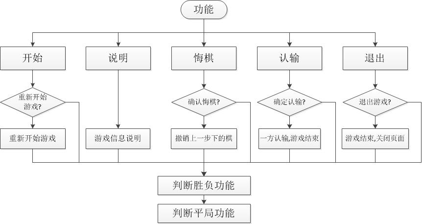
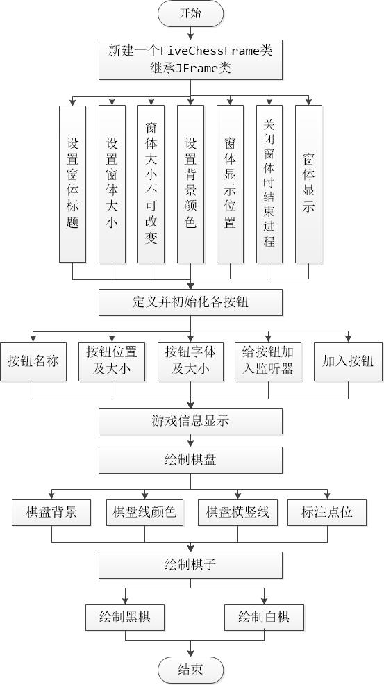

# game：java五子棋客户端
## 1.所使用的开发环境
Eclipse
## 2. 需求，软件功能架构图
五子棋的娱乐性强、规则简单、易学、流行性广,普通人不需长时间专门训练即可自如行棋,因此极受大众喜欢。本次课设需制作一款简单的五子棋游戏，界面美观简洁，故需在绘制棋盘界面，绘制棋子等以简洁为主。功能方面实现简单的几个功能，输入棋子，开始游戏，悔棋，认输等。
技术可行性：使用windows操作系统,Java语言,Eclipse开发环境，开发界面简洁、功能简单的五子棋单机小游戏。
经济可行性：开发成本低，只要有一台装有Eclipse软件的电脑，就可开发。
操作可行性：操作上主要使用鼠标点击，凭借点击的位置坐标确定棋子落子位置，方便简单。使用前只要看明白游戏规则及其方法即可。
功能结构图

流程图

## 3.论述界面设计过程，指出其设计上的创意及组件的布局策略

设计上的创意及组件的布局策略: 
界面设计用到的是JFrame类。先对主程序框进行设计，再设计分程序框架,设计遵循简约至上的原则,背景图案,颜色搭配及按钮等设计的尽量简单,同时加入个人特色。
## 4.论述程序逻辑的实现，包括类的设计、对象的协作过程等，必要时加以各种图形和表格辅助论述。不得以粘贴代码的方式代替设计部分。
五子棋游戏程序Fivechess类包括主类main及实现自定义的FiveChessFrame类。FiveChessFrame类继承JFrame类同时实现MouseLinstener接口。而FiveChessFrame类包含的主要方法及功能如下表：

程序逻辑实现的基本流程:

# 测试分析

## 总界面

## 各功能测试
人机对战界面

对战结果

悔棋功能测试:
点击悔棋按钮,确认悔棋,则撤销最后一步下的棋子,(只能悔一步棋)。

认输功能测试:
轮到下棋的那方点击认输按钮，确认认输，则该方认输，另一方获胜，游戏结束，继续下棋。

点击退出按钮直接返回游戏界面。
