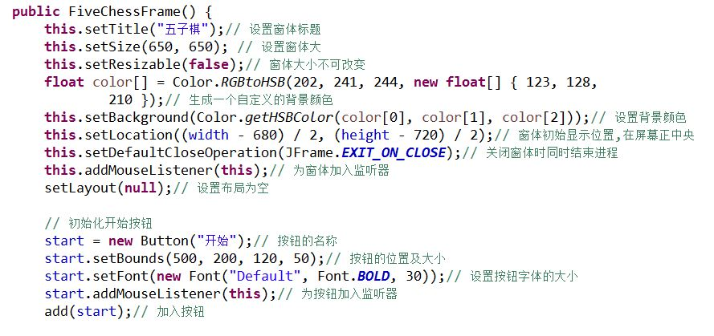
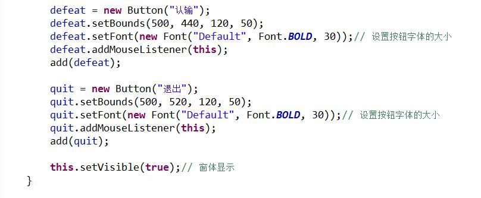

# game
java五子棋客户端
1.所使用的开发环境:Eclipse

## 部分代码截图

## 功能结构图

## 流程图

# 测试分析
## 总界面

# 各功能测试
## 人机对战界面

## 对战结果

## 悔棋功能测试
点击悔棋按钮,确认悔棋,则撤销最后一步下的棋子,(只能悔一步棋)。

## 认输功能测试
轮到下棋的那方点击认输按钮，确认认输，则该方认输，另一方获胜，游戏结束，继续下棋。

点击退出按钮直接返回游戏界面。
